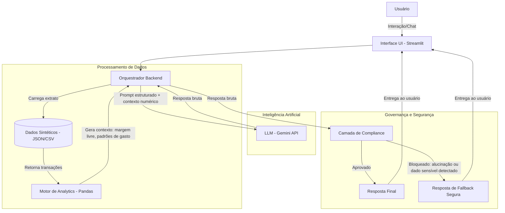

# VIT — Planejador Financeiro com IA Generativa

Agente conversacional que analisa dados financeiros de um cliente fictício e traduz os resultados em orientações claras, sem jargão e sem inventar números.

Desenvolvido como entrega do laboratório **"Construa seu Assistente Virtual com Inteligência Artificial"** da [DIO](https://www.dio.me/) para o bootcamp [Bradesco - GenAI & Dados](https://web.dio.me/track/bradesco-genai-dados).

## O que o VIT faz

- Processa um extrato de transações e calcula margem livre, gastos por categoria e progresso de metas
- Apresenta os resultados em linguagem natural via chat, usando o modelo Gemini (`gemini-3.1-flash-lite-preview`)
- Filtra produtos financeiros de acordo com o perfil de risco do cliente
- Recusa recomendações fora do catálogo, tentativas de prompt injection, requisições de dados bancários e conteúdo ilícito

## O que o VIT NÃO faz

- Não calcula nada — todos os números vêm do backend em Python/Pandas
- Não executa, agenda ou autoriza transações
- Não recomenda ativos individuais (ações, cripto)
- Não projeta rendimentos em valor absoluto
- Não armazena dados entre sessões

## Arquitetura



## Como Rodar

```bash
# 1. Clone o repositório
git clone https://github.com/EduTNV/Projeto-Final-DIO-Bradesco-Eduardo-VIT.git
cd Projeto-Final-DIO-Bradesco-Eduardo-VIT

# 2. Instale as dependências
pip install -r src/requirements.txt

# 3. Configure a chave de API
cp .env.example .env
# Edite o .env e coloque sua GEMINI_API_KEY do Google AI Studio

# 4. Rode a aplicação
cd src
streamlit run app.py
```

A aplicação estará disponível em `http://localhost:8501`.

## Estrutura do Repositório

```
├── data/                         # Dados sintéticos do cliente fictício
│   ├── transacoes.csv
│   ├── perfil_investidor.json
│   ├── produtos_financeiros.json
│   └── historico_atendimento.csv
│
├── docs/                         # Documentação do projeto
│   ├── 01-documentacao-agente.md
│   ├── 02-base-conhecimento.md
│   ├── 03-prompts.md
│   ├── 04-metricas.md
│   └── 05-pitch.md
│
├── src/                          # Código-fonte
│   ├── app.py
│   ├── agente.py
│   ├── analytics.py
│   ├── compliance.py
│   ├── models.py
│   ├── config.py
│   └── requirements.txt
│
├── .env.example                  # Template de variáveis de ambiente
├── .gitignore
└── README.md
```

## Stack

| Componente | Tecnologia |
|-----------|-----------|
| Interface | Streamlit |
| LLM | Google Gemini API (gemini-3.1-flash-lite-preview) |
| SDK | google-genai >= 1.0.0 |
| Processamento | Python + Pandas |
| Validação | Pydantic |
| Compliance | Regex + validação numérica contra contexto |
