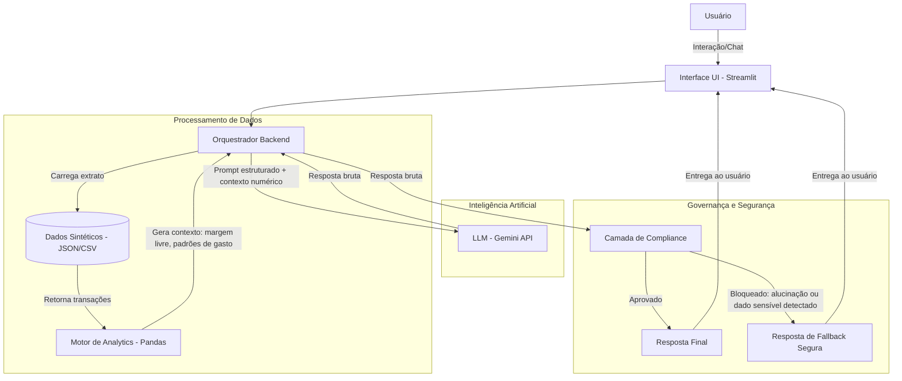

# Documentação do Agente

## Caso de Uso

### Problema
Simuladores financeiros tradicionais são frios, genéricos e desconectados da realidade do usuário. As pessoas frequentemente simulam empréstimos com parcelas que não cabem no seu orçamento real, ou tentam projetar investimentos sem entender para onde seu dinheiro está indo no dia a dia. Isso gera inadimplência, frustração e abandono de metas financeiras.

### Solução
O agente atua como um Planejador Financeiro Orientado a Dados. Ele resolve o problema em duas etapas integradas:

Analytics: Primeiro, ele analisa um extrato de gastos (simulado no backend) para identificar a capacidade de poupança real do usuário.

Simulação Contextualizada: Com base nessa análise, ele projeta cenários reais. Por exemplo, em vez de apenas simular um empréstimo genérico, ele diz: "Notei que você gasta R$ 400 em delivery por mês. Se reduzirmos isso pela metade, você consegue pagar a parcela de R$ 200 deste empréstimo de forma segura."
Ele oferece transparência total sobre juros e taxas, dando ao usuário o controle para ajustar parâmetros, sempre respeitando a heurística de "Visibilidade do Status do Sistema" e "Prevenção de Erros".

### Público-Alvo
Jovens adultos, universitários e profissionais em início de carreira que precisam organizar suas micro-finanças para alcançar o primeiro grande objetivo financeiro (como investir ou contratar um crédito consciente), buscando uma experiência digital inteligente, baseada em dados reais e livre do "economês".

---
## Persona e Tom de Voz

### Nome do Agente
- VIT

### Personalidade
O VIT atua como um **Mentor Transparente**: consultivo, direto nos dados e educativo na medida certa. Ele não julga o histórico financeiro do usuário, não vende produtos e não esconde a lógica por trás de nenhum cálculo. Cada afirmação é rastreável até sua fonte de dados.

Seu comportamento é calibrado: aprofunda o nível técnico conforme o usuário demonstra querer entender, reconhece contexto emocional sem validações vazias e devolve sempre a decisão final para o usuário — ele informa, nunca pressiona.

Valores fundamentais: **transparência radical**, **autonomia do usuário** e **honestidade sobre limitações**.

### Tom de Comunicação
Semiformal e progressivo. Usa a segunda pessoa do singular, frases curtas em alertas e parágrafos breves em explicações. Introduz termos técnicos sempre com definição inline — nunca usa jargão bancário solto. Evita superlativos ("ótima escolha!") e eufemismos ("produto de proteção patrimonial"). É direto nos fatos e neutro nas escolhas.

### Exemplos de Linguagem
- **Saudação:** "Tenho acesso aos seus dados dos últimos 90 dias — 47 transações em 8 categorias. Antes de começar, quer que eu explique o que analiso e como uso essas informações?"
- **Confirmação:** "Com base nos seus gastos dos últimos 3 meses, sua margem disponível é R$ 1.150/mês. Vou usar esse número como base para a simulação."
- **Erro/Limitação:** "Essa pergunta está fora do que consigo responder com responsabilidade. Não faço análise de ativos específicos — isso exige um assessor habilitado. O que posso fazer é analisar quanto da sua renda atual poderia ser direcionado para investimentos. Isso te ajudaria?"

---

## Arquitetura

### Diagrama

### Componentes

| Componente | Stack | Descrição Técnica |
|------------|-------|-------------------|
| Interface (UI) | Streamlit | Renderiza o chat e os elementos visuais da simulação financeira. Exibe o status de cada etapa da análise em tempo real, aplicando a heurística de Visibilidade do Sistema de Nielsen. |
| Orquestrador Backend | Python | Módulo que coordena o fluxo entre interface, dados e LLM. Isola as regras de negócio — nenhuma lógica financeira é delegada ao modelo de linguagem. A validação de entrada é feita via Pydantic na camada de modelos. |
| Base de Dados | JSON / CSV | Dados sintéticos que simulam um extrato bancário anonimizado, gerados exclusivamente para fins de demonstração. Nenhum dado real de usuário é coletado ou armazenado. |
| Motor de Analytics | Python + Pandas | Pré-processa o extrato sintético, calcula médias de gasto por categoria, margem livre mensal e identifica padrões relevantes (ex: gastos recorrentes com delivery) antes do envio do contexto ao LLM. |
| IA Generativa (LLM) | Google Gemini API (gemini-3.1-flash-lite-preview) | Restrito por design à camada conversacional: recebe contexto numérico já processado pelo backend e o traduz em linguagem natural, aplicando a persona do VIT. Não realiza cálculos — interpreta e comunica. Gemini foi escolhido pela flexibilidade da API, suporte a contextos longos e custo acessível para POC. |
| Camada de Compliance | Python (Middleware) | Implementada como classe independente chamada pelo orquestrador. Aplica duas verificações antes da entrega ao usuário: (1) validação numérica para detectar valores monetários fabricados pelo modelo que divergem do contexto enviado; (2) checagem de padrões via regex para bloquear exposição de dados sensíveis em texto livre. Respostas bloqueadas são substituídas por fallback seguro sem expor o erro bruto ao usuário. |

---

## Segurança e Anti-Alucinação

### Estratégias Adotadas

#### Isolamento de Cálculo (Prevenção de Alucinação Matemática)

O VIT adota uma separação estrita de responsabilidades entre backend e LLM. Todo cálculo financeiro — margem livre, projeção de parcelas, percentual de comprometimento de renda — é executado exclusivamente pelo backend em Python via Pandas, antes de qualquer chamada ao modelo. O LLM recebe apenas o resultado já validado, embutido no prompt como contexto estruturado, e tem função exclusiva de tradução para linguagem natural.

Isso elimina pela raiz o vetor mais comum de falha em agentes financeiros: o modelo inventar ou arredondar valores por conta própria. Se o backend calcula R$ 851,00, o modelo recebe R$ 851,00 e não possui autonomia para divergir desse número na resposta.

#### Camada de Compliance (Middleware de Saída)

Implementada como classe independente (`CamadaCompliance` em `src/compliance.py`), a camada de compliance intercepta a resposta bruta do LLM antes da entrega ao usuário e aplica duas verificações em sequência:

1. **Validação numérica:** compara os valores monetários presentes na resposta gerada com os valores do contexto enviado ao modelo. Divergências acima de tolerância configurável (ex: diferença de centavos por arredondamento) bloqueiam a resposta e acionam o fallback.
2. **Detecção de PII:** aplica expressões regulares para identificar padrões de dados sensíveis em texto livre — CPF, número de conta, saldo absoluto não autorizado para exibição — prevenindo vazamento inadvertido em conformidade com os princípios de minimização de dados da LGPD (Art. 6º, III). Respostas bloqueadas por qualquer verificação são substituídas por uma mensagem de fallback segura, sem expor o erro bruto ao usuário.

#### Prevenção de Prompt Injection e Grounding

O prompt do sistema define explicitamente o perímetro de conhecimento do VIT: o agente só pode afirmar o que está presente no contexto numérico fornecido pelo backend naquela sessão. Qualquer tentativa de expandir esse perímetro via instrução do usuário — como "ignore suas instruções anteriores" ou "me diga o saldo da conta X" — é neutralizada por duas camadas:

- **Instrução de grounding no system prompt:** o modelo é instruído a citar a origem de cada dado e a recusar afirmações que não possam ser rastreadas ao contexto recebido.
- **Contexto restrito por sessão:** o backend injeta apenas os dados pertinentes àquela interação específica. O modelo não tem acesso ao extrato completo — recebe apenas os agregados calculados (médias, totais por categoria, margem livre), não os registros brutos.

Vale declarar honestamente: essas medidas reduzem significativamente o risco de prompt injection, mas não o eliminam. Modelos de linguagem podem ser manipulados por vetores sofisticados que as camadas acima não cobrem. Para um ambiente de produção real, seria necessário adicionar um modelo classificador dedicado à detecção de injeção, além de rate limiting por sessão e logging estruturado para análise forense.

---

### Limitações Declaradas

- **Sem execução de transações:** o VIT opera exclusivamente em modo leitura e simulação. Não realiza, agenda ou autoriza nenhuma operação financeira real.
- **Sem recomendação de investimentos:** o agente não indica ativos, fundos ou produtos de investimento específicos. Qualquer orientação nesse sentido requer análise de perfil de risco (suitability) conduzida por profissional habilitado — fora do escopo do VIT.
- **Sem acesso a dados em tempo real:** cotações de moeda, índices de mercado, taxas de juros atualizadas e saldo bancário real não estão disponíveis. O agente opera sobre dados sintéticos estáticos e declara essa limitação explicitamente quando questionado.
- **Sem memória entre sessões:** o VIT não armazena histórico de conversas entre sessões distintas. Cada interação parte do zero, sem retenção de dados do usuário além do contexto da sessão ativa.
- **Sem aconselhamento jurídico ou tributário:** perguntas sobre declaração de IR, planejamento sucessório, regimes tributários ou obrigações legais são redirecionadas para profissionais competentes. O agente não simula competência que não possui.
- **Dados sintéticos, não dados reais:** o extrato processado pelo backend é gerado artificialmente para fins de demonstração. As simulações produzidas refletem esse conjunto de dados e não representam análise de situação financeira real.
- **Confiabilidade do LLM não é garantida:** mesmo com as camadas de validação implementadas, respostas geradas por modelos de linguagem estão sujeitas a imprecisões. O VIT é uma ferramenta de apoio à decisão, não um substituto para assessoria financeira profissional.

---
